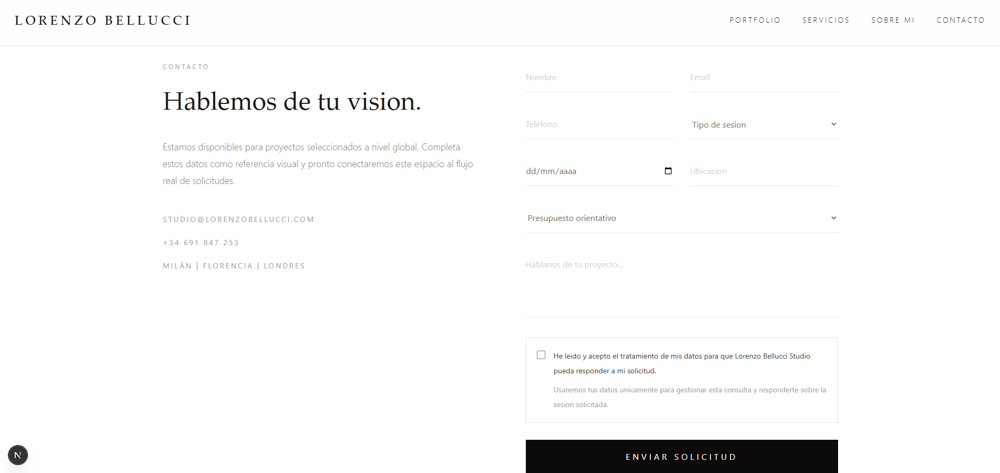
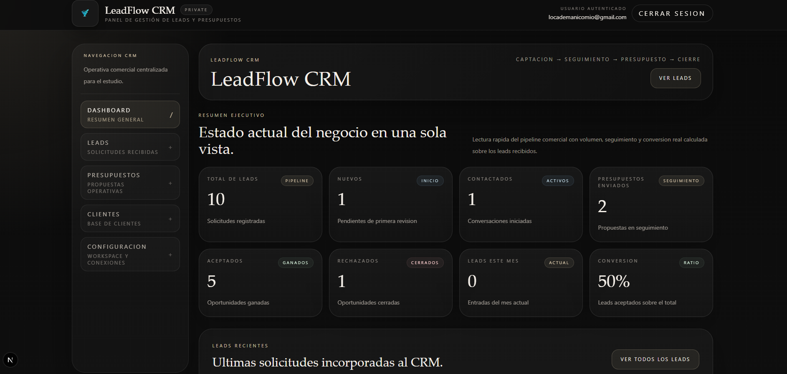
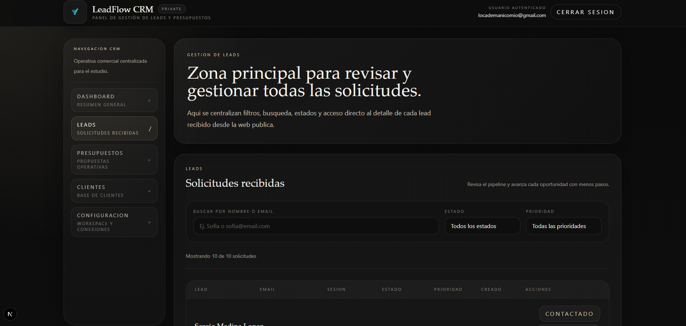
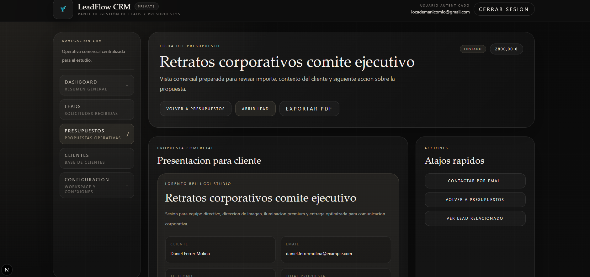
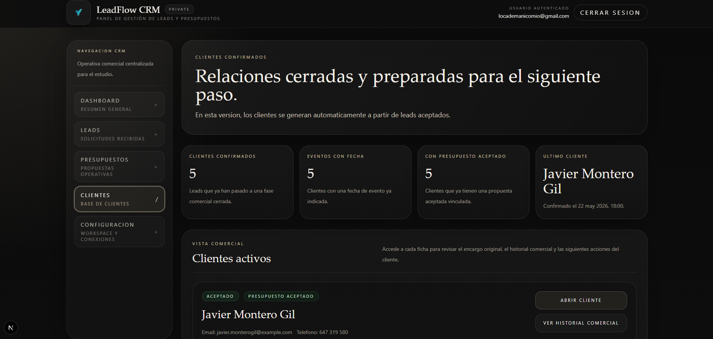
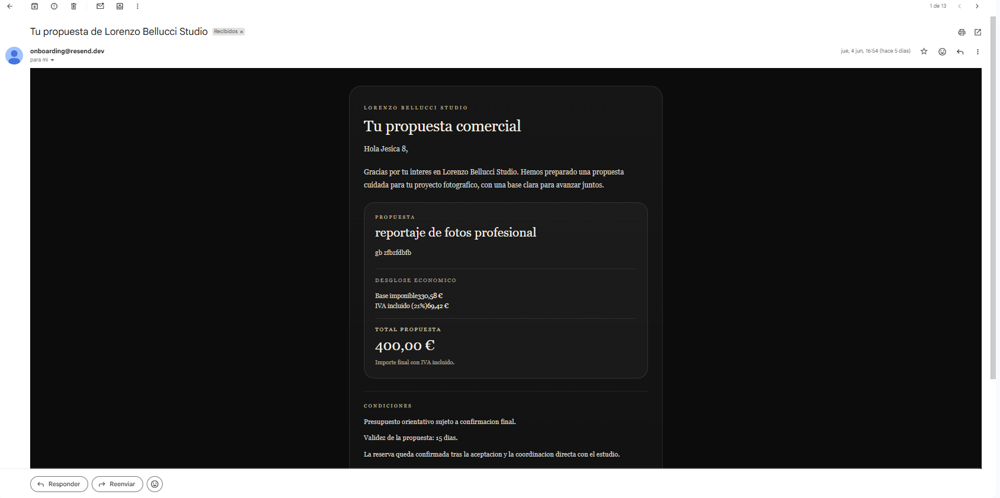
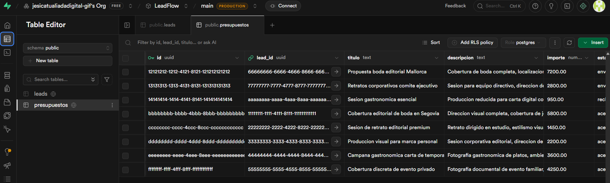

# LeadFlow CRM

CRM fullstack para captación de leads, presupuestos y clientes en un estudio fotográfico premium.

[](https://nextjs.org/)
[](https://www.typescriptlang.org/)
[](https://supabase.com/)
[](https://resend.com/)
[](https://vercel.com/)
[](https://tailwindcss.com/)

LeadFlow es una aplicación web desarrollada como proyecto académico y pieza de portfolio. Simula una plataforma profesional para **Lorenzo Bellucci Studio**, un estudio fotográfico premium ficticio, combinando una landing pública orientada a captación comercial con un CRM privado para gestionar solicitudes, presupuestos y clientes derivados.

---

## Accesos rápidos

| Acceso | Enlace |
|---|---|
| Web pública | https://leadflow-orpin-ten.vercel.app/ |
| CRM privado | https://leadflow-orpin-ten.vercel.app/dashboard |
| Documentación técnica | https://leadflow-orpin-ten.vercel.app/documentacion |

---

## Credenciales de demo

| Campo | Valor |
|---|---|
| Email | `locademanicomio@gmail.com` |
| Contraseña | `123456789` |

> Estas credenciales están destinadas únicamente a revisión académica y pruebas controladas.

---

## Demo

- Producción: https://leadflow-orpin-ten.vercel.app/
- Web pública: `/`
- Acceso CRM: `/dashboard`
- Documentación técnica: `/documentacion`

> El CRM está protegido mediante autenticación. Para acceder al panel privado es necesario iniciar sesión con un usuario autorizado.

---

## Capturas del proyecto

### Landing pública


### Formulario de captación



### Dashboard CRM



### Gestión de leads



### Presupuestos



### Clientes



### Email enviado / integración externa



### Supabase / base de datos



---

## Requisitos DAW cumplidos

- ✅ Frontend en Next.js
- ✅ Backend con Route Handlers
- ✅ Base de datos Supabase
- ✅ Autenticación Supabase Auth
- ✅ Integración externa Resend
- ✅ Despliegue en Vercel
- ✅ README documentado
- ✅ Uso de IA explicado

---

## Descripción

LeadFlow es una aplicación fullstack creada para centralizar el flujo comercial de un estudio fotográfico.

El sistema permite que un visitante solicite información o presupuesto desde una landing pública. Esa solicitud se registra como lead en la base de datos y queda disponible en un CRM privado, donde puede revisarse, actualizar su estado comercial, crear presupuestos vinculados, enviar propuestas por email y visualizar clientes confirmados.

El problema que resuelve es la pérdida de oportunidades comerciales en negocios creativos pequeños, donde las solicitudes pueden quedar repartidas entre formularios, emails, llamadas o mensajes sin seguimiento claro.

El proyecto está orientado a:

- Estudios fotográficos y negocios creativos.
- Profesionales que necesitan gestionar solicitudes comerciales.
- Pequeños negocios que buscan un CRM sencillo y visual.
- Contexto académico y portfolio de desarrollo fullstack.

---

## Funcionalidades

### Landing pública

- Landing principal para Lorenzo Bellucci Studio.
- Diseño editorial, minimalista y premium.
- Secciones de presentación, servicios, portfolio, proceso, testimonio y contacto.
- Ruta principal `/`.
- Ruta alternativa `/lorenzo-bellucci`.
- Rutas públicas complementarias:
  - `/portfolio`
  - `/servicios`
  - `/sobre`
  - `/contacto`

### Captación de leads

- Formulario público conectado al backend.
- Validación de campos obligatorios.
- Checkbox obligatorio de aceptación de tratamiento de datos.
- Creación de leads en Supabase.
- Estado inicial automático: `nuevo`.
- Prioridad inicial automática: `media`.
- Mensajes de éxito y error.
- Prevención de doble envío.

### CRM

- Panel privado protegido.
- Dashboard ejecutivo.
- Métricas generales.
- Listado de leads recientes.
- Navegación lateral.
- Diseño responsive.
- Estados de carga y empty states.

### Gestión de leads

- Listado completo de leads.
- Búsqueda por nombre o email.
- Filtros por estado y prioridad.
- Vista detalle de cada lead.
- Cambio de estado.
- Cambio de prioridad.
- Notas internas.
- Acciones rápidas:
  - marcar como contactado
  - crear presupuesto
  - enviar email mediante `mailto:`
  - llamar mediante `tel:`
- Eliminación de leads.
- Visualización de presupuestos asociados.

### Presupuestos

- Listado de presupuestos.
- Creación de presupuestos vinculados a leads.
- Creación de presupuestos para cliente manual.
- Edición de título, descripción, importe, fecha y estado.
- Estados disponibles:
  - `borrador`
  - `enviado`
  - `aceptado`
  - `rechazado`
- Envío de propuesta comercial por email mediante Resend.
- Sincronización automática con el estado del lead vinculado.
- Exportación mediante impresión del navegador.
- Desglose de IVA incluido al 21%.

### Clientes

- Vista de clientes confirmados.
- Los clientes se derivan de leads con estado `aceptado`.
- No existe una tabla física de clientes.
- Ficha individual de cliente.
- Historial comercial basado en presupuestos vinculados.

### Emails

- Email automático de confirmación al cliente al crear un lead.
- Notificación interna opcional para el estudio.
- Envío de propuestas comerciales por email.
- Integración con Resend.

### Autenticación

- Login privado mediante Supabase Auth.
- Autenticación con email y contraseña.
- Gestión de sesión con `@supabase/ssr`.
- Middleware de protección para rutas privadas.
- Logout funcional.

---

## Flujo comercial

```txt
Visitante
   |
   v
Landing pública
   |
   v
Formulario de solicitud
   |
   v
Lead nuevo en Supabase
   |
   v
Revisión desde CRM
   |
   v
Contacto con el cliente
   |
   v
Creación de presupuesto
   |
   v
Envío por email o exportación
   |
   v
Aceptado / Rechazado
   |
   v
Cliente confirmado
```

Versión resumida:

```txt
Lead -> Contactado -> Presupuesto -> Enviado -> Aceptado/Rechazado -> Cliente
```

---

## Arquitectura

| Capa | Implementación |
|---|---|
| Frontend | Next.js App Router, React Server Components y TailwindCSS |
| Backend | Route Handlers de Next.js bajo `src/app/api` |
| Base de datos | Supabase PostgreSQL |
| Autenticación | Supabase Auth con `@supabase/ssr` |
| Emails | Resend para emails transaccionales |
| Deploy | Vercel |

### Frontend

- Next.js con App Router.
- React Server Components para páginas y carga de datos.
- Client Components para formularios, autenticación, acciones interactivas y feedback visual.
- TailwindCSS para estilos.
- Imágenes locales gestionadas con `next/image`.

### Backend

- Route Handlers de Next.js.
- APIs internas bajo `src/app/api`.
- Validaciones y normalización de datos en helpers reutilizables.
- Operaciones server-side contra Supabase.

### Base de datos

- Supabase PostgreSQL.
- Tabla `leads`.
- Tabla `presupuestos`.
- Relación entre presupuestos y leads mediante `lead_id`.
- Clientes derivados desde leads aceptados.

### Auth

- Supabase Auth.
- `@supabase/ssr`.
- Middleware para proteger `/dashboard`.
- Login en `/login`.

### Emails

- Resend.
- Emails transaccionales para leads y presupuestos.
- Variables de entorno para API key, remitente y email interno.

### Deploy

- Proyecto desplegado en Vercel.
- Base de datos y autenticación en Supabase Cloud.
- Emails mediante Resend.

---

## Tecnologías utilizadas

| Área | Tecnologías |
|---|---|
| Frontend | Next.js `16.2.6`, React `19.2.4`, TailwindCSS `^4`, TypeScript |
| Backend | Route Handlers de Next.js, TypeScript, Supabase server client |
| Base de datos y autenticación | Supabase, PostgreSQL, Supabase Auth, `@supabase/ssr`, `@supabase/supabase-js` |
| Emails | Resend |
| Desarrollo y despliegue | npm, ESLint, Vercel, GitHub |

---

## Estructura del proyecto

```txt
LeadFlow/
├── docs/
│   ├── architecture.md
│   ├── logica-negocio.md
│   ├── desarrollo-fases.md
│   ├── supabase-leads.sql
│   ├── supabase-presupuestos.sql
│   ├── supabase-presupuestos-manual-client.sql
│   ├── supabase-presupuestos-fecha-evento.sql
│   └── supabase-demo-data.sql
├── public/
│   └── images/
│       └── capturasdoc/
├── src/
│   ├── app/
│   │   ├── api/
│   │   ├── dashboard/
│   │   ├── documentacion/
│   │   ├── login/
│   │   ├── lorenzo-bellucci/
│   │   └── page.tsx
│   ├── components/
│   │   ├── auth/
│   │   ├── dashboard/
│   │   ├── documentacion/
│   │   ├── forms/
│   │   ├── layout/
│   │   ├── lorenzo/
│   │   └── ui/
│   ├── images/
│   ├── lib/
│   │   ├── dashboard/
│   │   ├── supabase/
│   │   ├── leads.ts
│   │   ├── presupuestos.ts
│   │   ├── pricing.ts
│   │   ├── resend.ts
│   │   ├── studio.ts
│   │   └── toast.ts
│   ├── sections/
│   └── styles/
├── middleware.ts
├── package.json
└── README.md
```

---

## APIs

### Leads

#### `GET /api/leads`

Obtiene todos los leads ordenados por fecha de creación descendente.

#### `POST /api/leads`

Crea un nuevo lead desde el formulario público.

Campos principales:

```txt
nombre
email
telefono
tipo_sesion
fecha_evento
ubicacion
presupuesto
mensaje
```

Acciones adicionales:

- Valida datos obligatorios.
- Inserta el lead en Supabase.
- Envía email de confirmación al cliente.
- Envía notificación interna si `RESEND_ADMIN_EMAIL` está configurado.

#### `PATCH /api/leads/[id]`

Actualiza un lead existente.

Permite actualizar:

```txt
nombre
email
telefono
tipo_sesion
fecha_evento
ubicacion
presupuesto
mensaje
estado
prioridad
notas_internas
```

#### `DELETE /api/leads/[id]`

Elimina un lead por ID.

---

### Presupuestos

#### `GET /api/presupuestos`

Obtiene todos los presupuestos registrados.

#### `POST /api/presupuestos`

Crea un presupuesto.

Puede ser:

- Vinculado a un lead existente.
- Asociado a un cliente manual.

Campos principales:

```txt
lead_id
cliente_nombre
cliente_email
cliente_telefono
fecha_evento
titulo
descripcion
importe
estado
```

#### `PATCH /api/presupuestos/[id]`

Actualiza un presupuesto.

Si el presupuesto está vinculado a un lead, sincroniza el estado comercial:

```txt
presupuesto enviado  -> lead presupuesto_enviado
presupuesto aceptado -> lead aceptado
presupuesto rechazado -> lead rechazado
```

#### `POST /api/presupuestos/[id]/send`

Envía el presupuesto por email mediante Resend.

Acciones:

- Carga el presupuesto.
- Carga el lead vinculado si existe.
- Determina nombre y email del cliente.
- Envía la propuesta comercial.
- Actualiza el presupuesto a `enviado`.
- Actualiza el lead vinculado a `presupuesto_enviado`.

---

## Base de datos

La base de datos se gestiona con Supabase PostgreSQL.

### Tabla `leads`

Representa una solicitud comercial recibida desde la web pública.

Campos principales:

```txt
id
nombre
email
telefono
tipo_sesion
fecha_evento
ubicacion
presupuesto
mensaje
estado
prioridad
notas_internas
created_at
updated_at
```

Estados de lead:

```txt
nuevo
contactado
presupuesto_enviado
aceptado
rechazado
archivado
```

Prioridades:

```txt
baja
media
alta
```

### Tabla `presupuestos`

Representa una propuesta comercial.

Campos principales:

```txt
id
lead_id
cliente_nombre
cliente_email
cliente_telefono
fecha_evento
titulo
descripcion
importe
estado
created_at
updated_at
```

Estados de presupuesto:

```txt
borrador
enviado
aceptado
rechazado
```

Relación:

```txt
presupuestos.lead_id -> leads.id
```

### Clientes

No existe una tabla `clientes`.

En esta versión del MVP, los clientes se obtienen a partir de leads con estado:

```txt
aceptado
```

---

## Variables de entorno

Crear un archivo `.env` a partir de `.env.example`:

```env
NEXT_PUBLIC_SUPABASE_URL=
NEXT_PUBLIC_SUPABASE_ANON_KEY=
SUPABASE_SERVICE_ROLE_KEY=
DATABASE_URL=
RESEND_API_KEY=
RESEND_FROM_EMAIL=
RESEND_ADMIN_EMAIL=
```

| Variable | Uso |
|---|---|
| `NEXT_PUBLIC_SUPABASE_URL` | URL pública del proyecto Supabase |
| `NEXT_PUBLIC_SUPABASE_ANON_KEY` | Clave pública anon de Supabase |
| `SUPABASE_SERVICE_ROLE_KEY` | Clave privada para operaciones server-side |
| `DATABASE_URL` | URL de base de datos requerida por configuración |
| `RESEND_API_KEY` | Clave API de Resend |
| `RESEND_FROM_EMAIL` | Remitente de emails |
| `RESEND_ADMIN_EMAIL` | Email interno para notificaciones de nuevos leads |

> `SUPABASE_SERVICE_ROLE_KEY` no debe exponerse en cliente.

---

## Instalación local

Clonar el repositorio:

```bash
git clone https://github.com/JessicaNoLimit/LeadFlow.git
```

Entrar en el proyecto:

```bash
cd LeadFlow
```

Instalar dependencias:

```bash
npm install
```

Crear archivo de entorno:

```bash
cp .env.example .env
```

Configurar las variables de entorno necesarias.

Ejecutar el servidor de desarrollo:

```bash
npm run dev
```

Abrir en navegador:

```txt
http://localhost:3000
```

---

## Scripts disponibles

| Script | Descripción |
|---|---|
| `npm run dev` | Inicia el servidor de desarrollo |
| `npm run build` | Genera la build de producción |
| `npm run start` | Ejecuta la aplicación compilada |
| `npm run lint` | Ejecuta ESLint |

---

## Uso de IA durante el desarrollo

Durante el desarrollo de LeadFlow se utilizó inteligencia artificial como herramienta de apoyo técnico, organizativo y documental.

La IA ayudó principalmente en:

- Ideación inicial del producto.
- Definición del alcance del MVP.
- Organización de fases de desarrollo.
- Propuesta de arquitectura.
- Revisión de flujos de usuario.
- Redacción y mejora de documentación.
- Apoyo en validaciones y estructura de APIs.
- Revisión de errores y mejoras de experiencia de usuario.
- Preparación de datos demo y documentación final.

Las decisiones principales fueron revisadas manualmente:

- Elección del stack.
- Configuración real de Supabase.
- Configuración de autenticación.
- Configuración de Resend.
- Validación visual de la interfaz.
- Revisión del flujo comercial.
- Priorización de funcionalidades.
- Corrección de errores detectados durante el desarrollo.

El proyecto no se limitó a generar código automáticamente. Se estructuró, revisó, probó y ajustó de forma iterativa para conseguir un flujo funcional completo y coherente con una aplicación realista.

---

## Limitaciones actuales

LeadFlow está planteado como un MVP académico y de portfolio. Aunque el flujo principal está implementado, existen limitaciones conocidas:

- No hay tabla física de clientes; los clientes se derivan de leads aceptados.
- La exportación PDF se realiza mediante impresión del navegador, no mediante generación server-side.
- No hay roles avanzados ni permisos por tipo de usuario.
- No hay panel editable para configurar datos del estudio.
- No hay editor visual de plantillas de email.
- No hay sistema de reintentos o cola para emails.
- No hay tests automatizados configurados.
- No hay pipeline CI/CD en el repositorio.
- Algunas rutas públicas complementarias pertenecen a una fase anterior y conviene revisarlas si el producto evoluciona.
- Las APIs privadas deberían reforzarse con comprobaciones explícitas de sesión antes de una versión pública definitiva.

---

## Roadmap futuro

Posibles mejoras futuras:

- Protección explícita de APIs privadas mediante sesión.
- Usuario demo controlado para presentación.
- Tests automatizados para validaciones y flujos críticos.
- Tabla física de clientes si el CRM crece.
- Historial o timeline de actividad por lead.
- Filtros avanzados en presupuestos.
- Buscador en clientes y presupuestos.
- Generación PDF server-side.
- Plantillas de email configurables.
- Configuración editable desde el CRM.
- Roles y permisos.
- Integración con calendario.
- Automatizaciones de seguimiento.
- Integración con WhatsApp Business.
- Analítica comercial avanzada.
- Pipeline CI/CD.

---

## Autor

Proyecto desarrollado por **Jesica Serrano** como trabajo final de prácticas en CodeNode y pieza de portfolio fullstack dentro del ciclo de Desarrollo de Aplicaciones Web (DAW).

Repositorio:

```txt
https://github.com/JessicaNoLimit/LeadFlow
```
